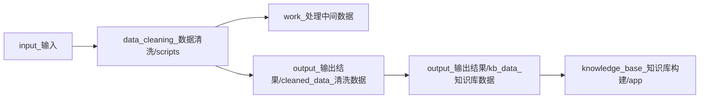

# 左联知识库 - 让1930年代的人物网络重新可读

> 从目录卡片、文献摘录与表格记录出发，把左联历史转成可查询、可解释、可视化的知识网络。

[](#快速开始)
[](#快速开始)
[](#数据快照)
[](LICENSE)


---

## 这是一个什么项目

`左联知识库`聚焦中国左翼作家联盟（1930-1936）相关人物与事件，做三件事：

1. 把原始资料清洗成标准化数据表（人物、关系、事件、地点、来源）。
2. 让数据可被程序稳定读取（唯一生产数据源，统一字段约束）。
3. 用 Streamlit 提供研究导向的交互界面（人物档案、关系总览、事件地图、统计分析）。

如果你希望这个项目像一个完整产品而不是一次性脚本集合，这个仓库就是对应的工程版本。

---

## 数据快照

当前仓库内的核心知识库数据位于 `output_输出结果/kb_data_知识库数据/`：

| 数据表 | 记录数 |
| --- | ---: |
| `persons.csv` | 150 |
| `person_relations.csv` | 4238 |
| `events.csv` | 314 |
| `places.csv` | 78 |
| `organizations.csv` | 3 |
| `org_memberships.csv` | 150 |
| `event_participants.csv` | 406 |
| `sources.csv` | 1125 |

---

## 你可以在这里做什么

| 场景 | 能力 |
| --- | --- |
| 人文研究 | 查询某人物的关系网络、证据链和历史事件参与轨迹 |
| 教学展示 | 使用事件地图与统计模块做课堂演示 |
| 数据工程 | 复用清洗脚本，增量更新标准 CSV |
| 应用开发 | 在标准数据层上构建检索、问答、分析工具 |

---

## 数据流与架构



关键约束：

- 应用层只读取 `output_输出结果/kb_data_知识库数据/`。
- `work_处理中间数据/`、`archive_归档/` 不作为生产数据源。
- 清洗脚本统一从 `input_输入/` 读取，输出到 `output_输出结果/`。

---

## 快速开始

### 1. 安装依赖

```bash
python -m venv .venv
.venv\Scripts\activate
pip install -r requirements.txt
```

### 2. 启动应用

```bash
cd knowledge_base_知识库构建/app
streamlit run app.py
```

### 3. 可选：重建标准知识库数据

```bash
cd data_cleaning_数据清洗/scripts
python build_standard_kb_pipeline.py
```

---

## 环境变量

涉及 LLM 的脚本已移除硬编码密钥，使用环境变量注入：

```bash
OPENAI_API_KEY=your_api_key
OPENAI_BASE_URL=https://api.openai.com/v1
OPENAI_MODEL=gpt-4o
```

可直接参考 `.env.example`。

---

## 目录地图

```text
左联知识库项目/
├─ input_输入/                    # 原始输入数据
├─ data_cleaning_数据清洗/         # 清洗、提取、验证脚本
├─ work_处理中间数据/              # 中间产物（默认不入库）
├─ output_输出结果/
│  └─ kb_data_知识库数据/          # 唯一生产数据源
├─ knowledge_base_知识库构建/
│  └─ app/                        # Streamlit 应用入口
├─ docs_文档/                     # 项目文档
└─ archive_归档/                   # 历史文件
```

---

## 发布约定

- 默认提交：代码、文档、核心知识库数据。
- 默认忽略：缓存、归档、中间结果、日志、本地备份与版权风险文本。
- 若新增脚本涉及外部 API，请保持“环境变量注入密钥”的策略。

---

## License

[MIT](LICENSE)
