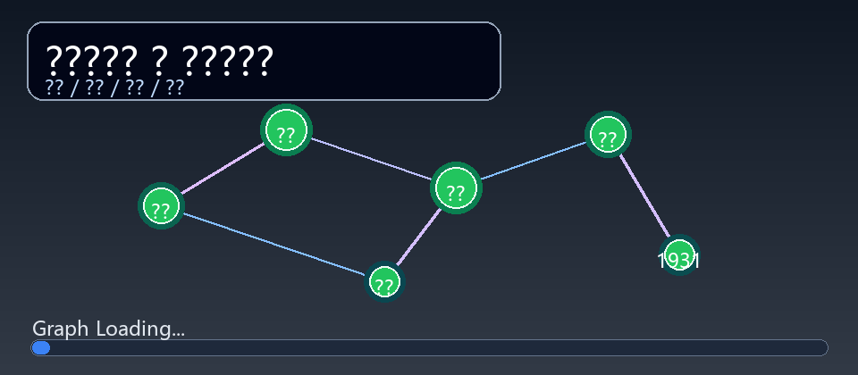
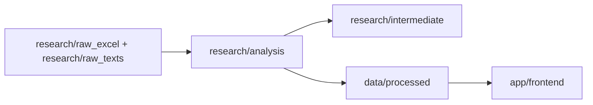

# 左联知识库 - 让1930年代的人物网络重新可读

> 从目录卡片、文献摘录与表格记录出发，把左联历史转成可查询、可解释、可视化的知识网络。

[](#快速开始)
[](#快速开始)
[](#数据快照)
[](LICENSE)

在线阅读：
[GitHub Pages 静态阅读版](https://flat0312.github.io/Zuolian-Data-Visualization/)


---

## ✨ 项目标语（Slogan）

> 把史料从“可读”推进到“可计算”，让左联历史在数据网络中重新发声。

> 让人物不再只是名字，让关系不再只是注脚，让事件不再只是时间点。

---

## 📌 这是一个什么项目

`左联知识库`聚焦中国左翼作家联盟（1930-1936）相关人物与事件，做三件事：

1. 把原始资料清洗成标准化数据表（人物、关系、事件、地点、来源）。
2. 让数据可被程序稳定读取（唯一生产数据源，统一字段约束）。
3. 用 Streamlit 提供研究导向的交互界面（人物档案、关系总览、事件地图、统计分析）。

如果你希望这个项目像一个完整产品而不是一次性脚本集合，这个仓库就是对应的工程版本。

---

## 💡 核心突破

> [!TIP]
> **结构化突破**：把人物、关系、事件、地点统一建模后，历史资料可以被检索、筛选、关联和验证。

> [!IMPORTANT]
> **工程化突破**：从输入、清洗、中间层到最终知识库数据，形成了可重复执行的标准流程。

> [!NOTE]
> **应用化突破**：同一份标准数据，直接支撑人物档案、关系总览、事件地图、统计分析四种视图。

---

## 📊 数据快照

当前仓库内的核心知识库数据位于 `data/processed/`：

| 数据表 | 记录数 |
| --- | ---: |
| `persons.csv` | 150 |
| `person_relations.csv` | 4238 |
| `events.csv` | 279 |
| `places.csv` | 86 |
| `organizations.csv` | 3 |
| `org_memberships.csv` | 150 |
| `event_participants.csv` | 371 |
| `sources.csv` | 1130 |

---

## 🎬 动图演示



动图展示的是项目核心体验：人物节点、关系连线、事件线索和加载流程的组合视觉。

---

## 🧪 你可以在这里做什么

| 场景 | 能力 |
| --- | --- |
| 人文研究 | 查询某人物的关系网络、证据链和历史事件参与轨迹 |
| 教学展示 | 使用事件地图与统计模块做课堂演示 |
| 数据工程 | 复用清洗脚本，增量更新标准 CSV |
| 应用开发 | 在标准数据层上构建检索、问答、分析工具 |

---

## 🧭 数据流与架构



关键约束：

- 🔒 应用主数据读取 `data/processed/`。
- 🔒 关系证据页使用 `data/processed/runtime_sources/` 下的运行期证据索引副本，不直接依赖研究过程目录。
- 🗂️ `research/` 下均视为研究过程资产，不作为主产品目录结构的一部分。

---

## 🚀 快速开始

### 1. 🧰 安装依赖

```bash
python -m venv .venv
.venv\Scripts\activate
pip install -r requirements.txt
```

### 2. 🖥️ 启动应用

安装完依赖后，只需在仓库根目录执行一条命令，不需要再 `cd` 到子目录。

```bash
streamlit run app.py
```

如果你在 Windows PowerShell 下，也可以直接运行：

```powershell
.\start.ps1
```

### 2.5. 📚 生成静态阅读版（GitHub Pages）

如果你希望仓库像一个可直接在线阅读的网站，而不是必须运行 Streamlit，可以在根目录执行：

```bash
python build_static_site.py
```

执行后会生成 `docs/` 目录，内容包括：

- 首页总览
- 人物档案索引与人物详情页
- 事件索引与事件详情页
- 关系索引
- 前端全文搜索索引

这套页面不依赖 Python 后端，适合直接发布到 GitHub Pages。

### 3. 🔁 可选：重建标准知识库数据

```bash
cd research/analysis
python build_standard_kb_pipeline.py
```

直接浏览知识库前台不需要配置任何环境变量；只要仓库内的标准数据文件存在，就可以本地启动和查看。

---

## ☁️ 在线部署（Render）

仓库已内置 Render Blueprint 配置文件：`render.yaml`。

上线步骤：

1. 在 Render 选择 `New +` -> `Blueprint`。
2. 连接仓库 `Flat0312/Zuolian-Data-Visualization`。
3. 直接应用 `render.yaml` 并部署。

详细说明见 [`DEPLOY_RENDER.md`](DEPLOY_RENDER.md)。

---

## 🌐 在线部署（GitHub Pages 静态阅读版）

仓库现已包含：

- 静态站生成脚本：`build_static_site.py`
- 静态资源模板：`static_site/`
- Pages 工作流：`.github/workflows/static-pages.yml`

推荐部署方式：

1. 在仓库中启用 GitHub Pages。
2. Source 选择 `GitHub Actions`。
3. 推送到 `main` 后，工作流会自动生成 `docs/` 并发布。

发布地址：
[https://flat0312.github.io/Zuolian-Data-Visualization/](https://flat0312.github.io/Zuolian-Data-Visualization/)

如果你只想本地预览，也可以先运行：

```bash
python build_static_site.py
```

然后直接打开 `docs/index.html` 查看页面结构。

---

## 🔐 环境变量

直接打开知识库前台不需要环境变量。只有涉及外部模型调用的脚本，才需要通过环境变量注入密钥，例如：

```bash
OPENAI_API_KEY=your_api_key
OPENAI_BASE_URL=https://api.openai.com/v1
OPENAI_MODEL=gpt-4o
```

可直接参考 `.env.example`。如果你只是想浏览知识库页面，可以跳过这一步。

---

## 🗺️ 目录地图

```text
左联知识库项目/
├─ app/
│  └─ frontend/                   # Streamlit 应用入口
├─ data/
│  └─ processed/                  # 运行期标准数据与证据索引
└─ research/                      # 原始数据、清洗中间表、研究脚本与草稿
```

---

## 📦 发布约定

- 默认提交：代码、文档、核心知识库数据。
- 默认忽略：缓存、归档、中间结果、日志、本地备份与版权风险文本。
- 若新增脚本涉及外部 API，请保持“环境变量注入密钥”的策略。

---

## 🗓️ 近期进展与下一步

- ✅ 已完成：仓库产品化重构（README、License、忽略策略、CI 冒烟检查）。
- ✅ 已完成：API Key 去硬编码，改为环境变量注入。
- ✅ 已完成：标准知识库数据入库（`data/processed`）。
- 🔜 下一步：补充真实应用操作录屏并替换当前演示动图。
- 🔜 下一步：增加“按人物/事件检索”的在线 demo 链接。

---

## 📄 License

[MIT](LICENSE)
