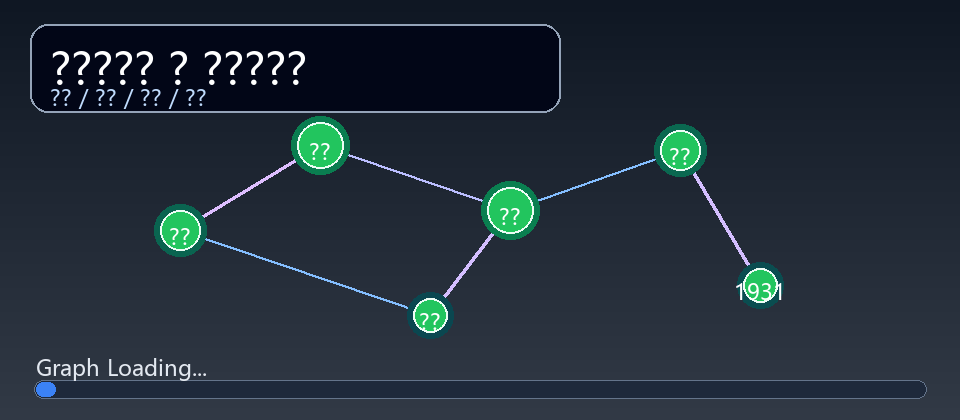
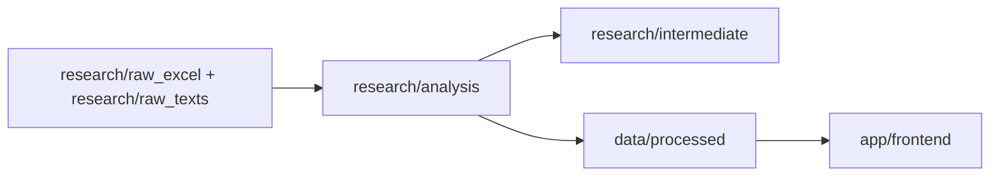

# 左联知识库 - 让1930年代的人物网络重新可读

> 从目录卡片、文献摘录与表格记录出发，把左联历史转成可查询、可解释、可视化的知识网络。

2026-09-05 内容入口：[研究观察与解释边界](research/drafts/reports/phase6_research_findings.md) · [首篇专题初稿](research/drafts/topics/1928-correspondence/专题初稿.md) · [人物与地点内容卡](research/drafts/topics/1928-correspondence/人物与地点内容卡.md) · [答辩文字稿](research/drafts/defense/答辩大纲.md)。专题仍待人工复核，尚未公开。

[](#快速开始)
[](#快速开始)
[](#数据快照)
[](LICENSE)

在线阅读：
[GitHub Pages 静态阅读版](https://flat0312.github.io/Zuolian-Data-Visualization/)


---

## ✨ 项目标语（Slogan）

> 把史料从“可读”推进到“可计算”，让左联历史在数据网络中重新发声。

> 让人物不再只是名字，让关系不再只是注脚，让事件不再只是时间点。

---

## 📌 这是一个什么项目

`左联知识库`聚焦中国左翼作家联盟（1930-1936）相关人物与事件，做三件事：

1. 把原始资料清洗成标准化数据表（人物、关系、事件、地点、来源）。
2. 让数据可被程序稳定读取（唯一生产数据源，统一字段约束）。
3. 用 Streamlit 提供研究导向的交互界面（人物档案、关系总览、事件地图、统计分析）。

组织身份采用证据台账驱动判定。`org_membership_evidences.csv` 保存可定位材料，
`org_memberships.csv` 保存由证据规则生成的正式成员、相关人士、候选与争议结论；
人物角色不再自动等同于左联正式成员身份。

`fact_evidences.csv` 是跨领域事实证据总表。它记录具体事实的主体、谓词、来源、
定位与摘录；实体表中的 `source_ids` 仅表示关联来源，不等同于具体事实已经获得证实。

如果你希望这个项目像一个完整产品而不是一次性脚本集合，这个仓库就是对应的工程版本。

---

## 💡 核心突破

> [!TIP]
> **结构化突破**：把人物、关系、事件、地点统一建模后，历史资料可以被检索、筛选、关联和验证。

> [!IMPORTANT]
> **工程化突破**：从输入、清洗、中间层到最终知识库数据，形成了可重复执行的标准流程。

> [!NOTE]
> **应用化突破**：同一份标准数据，直接支撑人物档案、关系总览、事件地图、统计分析四种视图。

---

## 📊 数据快照

当前仓库内的核心知识库数据位于 `data/processed/`：

| 数据表 | 记录数 |
| --- | ---: |
| `persons.csv` | 162 |
| `person_relations.csv` | 4238 |
| `events.csv` | 147 |
| `places.csv` | 41 |
| `organizations.csv` | 36 |
| `org_memberships.csv` | 150 |
| `org_membership_evidences.csv` | 581 |
| `fact_evidences.csv` | 626 |
| `event_participants.csv` | 222 |
| `relation_evidences.csv` | 10272 |
| `sources.csv` | 1178 |
| `source_passages.csv` | 1178 |
| `source_works.csv` | 65 |

以上为研究层行数。1178条是引用记录，对应65条作品级记录和30个非空来源族，不能理解为1178份独立史料。

4238条人物关系中，满足公开条件的为**7条**（`publish_status=supported`，全部由证据派生，`publish_status_origin=derived`）；人工确认口径（`verified`）为0条，两批均未使用人工裁决通道。其余为 `pending_review` 2451条、`inferred` 1780条，只留在研究层。`relation_evidences.csv` 的10272行中只有23行是经逐字复核与「双方佐证门」的 `support` 级证据（第一批 20 行 + 第二批 3 行），其余10249行为机器迁移生成的 `associated` 行，语义是「来源关联」，**不断言支持强度**，不得当作支持证据引用。组织身份有45条正式、28条相关、77条候选，前两类共73条进入展示层。

**两批公开层口径不同，引用时不得混为一谈。** 7条公开关系中：

- **5条**来自 2026-09-20「授权按建议执行」概括授权（签核路径 C，口径为「全量按 AI 建议执行」，非逐条独立人工复核）；
- **2条**来自 2026-10-08 逐条独立人工裁决（REL-00622 周扬—邵荃麟、REL-01368 郁达夫—陈望道，口径较强）。

关系公开的收敛链为：4238条 → 抽样400条人工裁决 → 48条判为直接支持且裁决成立 → 20条通过双方佐证门（引文确实同时记载当事人）→ 5条通过发布门禁的保守规则（排除 critical/high 风险、待核验、推断类型、low 置信）；
2026-10-08 重捕批次再补：28条重捕候选中 4条经逐条裁决，3条落地 support 证据（REL-00622、REL-01161、REL-01368）、1条判证据不足（REL-01891，生产层零改动），经门禁后新增2条公开（REL-01161 因 critical 风险 + low 置信 + 同属组织被自然挡在 `pending_review`），公开层 5→7。
台账见 [`phase5_relation_landing_ledger.csv`](research/drafts/reports/phase5_relation_landing_ledger.csv) 与 [`phase5_recapture_landing_ledger.csv`](research/drafts/reports/phase5_recapture_landing_ledger.csv)，口径与未做事项见 [`phase5_relation_landing_report.md`](research/drafts/reports/phase5_relation_landing_report.md) 与 [`phase5_recapture_landing_report.md`](research/drafts/reports/phase5_recapture_landing_report.md)。以上数字于2026-10-08读取本地数据核对。

---

## 🎨 设计语言

界面采用 **Notion × Claude 混合风格**：

- **Notion 暖色极简**：纯净暖白底色 `#FAFAF8`，极细边框，大留白，衬线正文营造阅读感。
- **Claude 赭石强调**：主色 `#C87941` 贯穿交互元素（选中态、链接、指标数字），沉稳而不沉闷。
- **双字体体系**：正文使用 Noto Serif SC（衬线，阅读舒适），UI 标签使用 Inter（无衬线，信息清晰）。

静态站（GitHub Pages）与 Streamlit 应用共享同一套设计令牌。

---

## 🎬 动图演示



动图展示的是项目核心体验：人物节点、关系连线、事件线索和加载流程的组合视觉。

---

## 🧪 你可以在这里做什么

| 场景 | 能力 |
| --- | --- |
| 人文研究 | 查询某人物的关系网络、证据链和历史事件参与轨迹 |
| 教学展示 | 使用事件地图与统计模块做课堂演示 |
| 数据工程 | 复用清洗脚本，增量更新标准 CSV |
| 应用开发 | 在标准数据层上构建检索、问答、分析工具 |

---

## 🧭 数据流与架构


```mermaid
flowchart LR
    A["research/raw_excel + research/raw_texts"] --> B["research/analysis"]
    B --> C["research/intermediate"]
    B --> D["data/processed"]
    D --> E["app/frontend"]
```

关键约束：

- 🔒 应用主数据读取 `data/processed/`。
- 🔒 关系证据页使用 `data/processed/runtime_sources/` 下的运行期证据索引副本，不直接依赖研究过程目录。
- 🗂️ `research/` 下均视为研究过程资产，不作为主产品目录结构的一部分。

---

## 🚀 快速开始

### 1. 🧰 安装依赖

```bash
python -m venv .venv
.venv\Scripts\activate
python -m pip install -r requirements.txt
```

### 2. 🖥️ 启动应用

安装完依赖后，在仓库根目录直接运行：

```bash
python -m streamlit run app.py
```

启动成功后，浏览器打开 `http://localhost:8501`。

如果系统已安装 PowerShell 7，且允许执行本地 PowerShell 脚本，也可以运行：

```powershell
pwsh ./tasks.ps1 run
```

若提示“`pwsh` 无法识别”或“禁止运行脚本”，请使用上面的 `python -m streamlit run app.py`，无需修改系统执行策略。

### 2.5. 📚 生成静态阅读版（GitHub Pages）

如果你希望仓库像一个可直接在线阅读的网站，而不是必须运行 Streamlit，可以在根目录执行：

```bash
python build_static_site.py
```

执行后会生成 `docs/` 目录，内容包括：

- 首页总览
- 人物档案索引与人物详情页
- 事件索引与事件详情页
- 关系索引
- 前端全文搜索索引

这套页面不依赖 Python 后端，适合直接发布到 GitHub Pages。

### 3. 🔁 可选：重建标准知识库数据

```bash
cd research/analysis
python build_standard_kb_pipeline.py
```

直接浏览知识库前台不需要配置任何环境变量；只要仓库内的标准数据文件存在，就可以本地启动和查看。

### 4. ✅ 测试与基线检查

```bash
python -m ruff check app.py build_static_site.py kb_schema.py app research/analysis
python -m pytest
```

---

## ☁️ 在线部署（Render）

仓库已内置 Render Blueprint 配置文件：`render.yaml`。

上线步骤：

1. 在 Render 选择 `New +` -> `Blueprint`。
2. 连接仓库 `Flat0312/Zuolian-Data-Visualization`。
3. 直接应用 `render.yaml` 并部署。

详细说明见 [`DEPLOY_RENDER.md`](DEPLOY_RENDER.md)。

---

## 🌐 在线部署（GitHub Pages 静态阅读版）

仓库现已包含：

- 静态站生成脚本：`build_static_site.py`
- 静态资源模板：`static_site/`
- Pages 工作流：`.github/workflows/static-pages.yml`

推荐部署方式：

1. 在仓库中启用 GitHub Pages。
2. Source 选择 `GitHub Actions`。
3. 推送到 `main` 后，工作流会自动生成 `docs/` 并发布。

发布地址：
[https://flat0312.github.io/Zuolian-Data-Visualization/](https://flat0312.github.io/Zuolian-Data-Visualization/)

如果你只想本地预览，也可以先运行：

```bash
python build_static_site.py
```

然后直接打开 `docs/index.html` 查看页面结构。

---

## 🔐 环境变量

直接打开知识库前台不需要环境变量。只有涉及外部模型调用的脚本，才需要通过环境变量注入密钥，例如：

```bash
OPENAI_API_KEY=your_api_key
OPENAI_BASE_URL=https://api.openai.com/v1
OPENAI_MODEL=gpt-4o
```

可直接参考 `.env.example`。如果你只是想浏览知识库页面，可以跳过这一步。

---

## 🗺️ 目录地图

```text
左联知识库项目/
├─ app/
│  └─ frontend/                   # Streamlit 应用入口
├─ data/
│  └─ processed/                  # 运行期标准数据与证据索引
└─ research/                      # 原始数据、清洗中间表、研究脚本与草稿
   ├─ analysis/                   # 数据构建、发布门禁与校验脚本
   ├─ design/                     # 双层架构设计与各阶段实施方案（受版本管理）
   └─ drafts/reports/             # 阶段报告、审核队列、裁决与落地台账
```

---

## 📦 发布约定

- 默认提交：代码、文档、核心知识库数据。
- 默认忽略：缓存、归档、中间结果、日志、本地备份与版权风险文本。
- 若新增脚本涉及外部 API，请保持“环境变量注入密钥”的策略。

---

## 🗓️ 当前进展与收尾重点

- ✅ 已完成：证据驱动的组织身份重建、事实证据层、研究层与发布层分离。
- ✅ 已完成：事件地点质量治理、人物关系分层抽样和基础网络分析。
- ✅ 已完成：标准知识库、Streamlit 应用与 GitHub Pages 静态阅读版。
- ✅ 已完成：第三批事件史料 20 条证据按事件级审核决策合并转正（人工授权状态：**已追认**，追认日期 2026-08-27，见审核表第 7 节）。第四批A 5 项裁决已按授权落入生产层，当前事件覆盖率为 17.7%（26/147）；覆盖率报告已区分「已挂接 26/147 / 直接支持 21/147 / 已确认 26/147」三种口径，拒绝证据不进入覆盖率和发布层。
- ✅ 已完成：400 条人物关系裁决（成立率 40.2%／类型准确率 33.8%，口径为「授权按建议执行」）与分层准确率、修订规则。
- ✅ 2026-09-28 已完成：裁决的生产层落地。新增「双方佐证门」逐条复核引文，公开关系 0→5，发布层与静态站关系图谱首次非空；同时查出夜间轮引文按页码窗口截取导致 `reason` 与 `quote` 不一致的系统性缺陷，28 条转入重捕队列（生产层零改动）。
- ✅ 2026-10-08 已完成：重捕候选第二批生产层落地。用户对 4 条**逐条独立裁决**（口径强于概括授权）：REL-00622 周扬—邵荃麟、REL-01368 郁达夫—陈望道直接过并公开（后者类型 交游→签名联署）；REL-01161 阳翰笙—林淡秋成立、落地证据但被门禁自然挡在 `pending_review`；REL-01891 叶紫—萧军判「证据不足」，生产层零改动（不写 rejected）。公开关系 5→7。
- 🔜 收尾重点：剩余 24 条引文重捕候选待处置（16 条同窗共现仅顿号人名罗列级、5 条重捕被拒[跨页标记 2 + 页码不一致 3]、3 条本地原文中找不到同窗共现）；如需公开被保守规则挡住的关系（含本批 REL-01161），须逐条独立人工复核后走 `human_adjudication` 通道。
- ✅ 2026-09-05 已校正研究结论和答辩文字稿，完成首篇交往专题初稿、10个人物片段与5个地点或机构内容卡；候选证据未转正。旧版“桥接者”“三条工作线”“多中心领导”等强解释不再作为已证实结论。
- 🔜 收尾重点：核准首批关系候选，补查稿件与历史地址，再形成有史料支撑的专题研究。按新版文字大纲更新答辩PPT并实际演练；既有PPTX为旧版，本轮未重制。

详细状态、验收命令和剩余任务见 [`task_plan.md`](task_plan.md)。

---

## 📄 License

[MIT](LICENSE)
